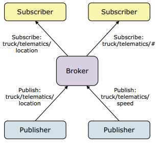

# MQTT 

  MQTT was developed by Andy Stanford-Clark (IBM) and Arlen Nipper (Eurotech; now Cirrus Link) in 1999 for the monitoring of an oil pipeline through the desert. The goals were to have a protocol, which is bandwidth-efficient and uses little battery power, because the devices were connected via satellite link and this was extremely expensive at that time.
The protocol uses a publish/subscribe architecture in contrast to HTTP with its request/response paradigm. 

Publish/Subscribe is event-driven and enables messages to be pushed to clients. The central communication point is the MQTT broker, it is in charge of dispatching all messages between the senders and the rightful receivers. Each client that publishes a message to the broker, includes a topic into the message. The topic is the routing information for the broker. Each client that wants to receive messages subscribes to a certain topic and the broker delivers all messages with the matching topic to the client. Therefore the clients don’t have to know each other, they only communicate over the topic. This architecture enables highly scalable solutions without dependencies between the data producers and the data consumers.

[Architecture](./MQTT-Architecture.png)

